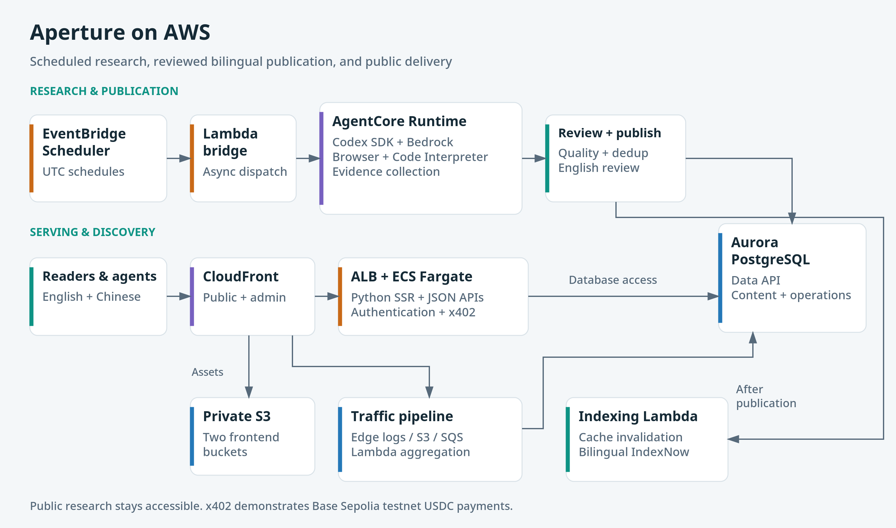

# Aperture Intelligence

Aperture is an AWS reference application for turning public sources into reviewed research that people and AI agents can discover, cite, and access programmatically. It connects automated research, bilingual publishing, search discovery, usage measurement, and x402 payments in one working system.

[Live website](https://aperture.zhangwangshu.com/) · [English presentation](docs/presentation/aperture-intelligence-en.pptx) · [Documentation](docs/README.md)

## Architecture



[Editable draw.io diagrams](docs/architecture/aperture-aws.drawio) · [Architecture details](docs/architecture.md)

## How it works

- **Research:** EventBridge Scheduler invokes a Lambda bridge and Bedrock AgentCore Runtime. The runtime uses a Codex SDK worker, Browser, Code Interpreter, and Bedrock inference to collect evidence and draft research.
- **Review and publish:** Evidence quality, full-catalogue semantic deduplication, and an independently reviewed English edition must pass before automatic publication. Database guards preserve published URLs and reject missing or stale translations.
- **Serve and discover:** CloudFront serves private S3 assets and routes HTML/API requests through an ALB to an ECS Fargate API. Aurora PostgreSQL stores content and operational data. English uses the existing URLs; Chinese uses `/zh/`. SSR, JSON-LD, canonical/hreflang links, sitemaps, RSS, and IndexNow support discovery.
- **Measure:** CloudFront logs flow through S3, SQS, and a Lambda aggregator. The separate admin console reports approximate human/agent traffic, research jobs, reader attribution, and payment events.
- **Agent access:** Open JSON and an x402-protected route demonstrate programmatic delivery. The seller verifies and settles payments through an external facilitator before returning paid content.

The payment demonstration uses **Base Sepolia testnet USDC**, not production revenue. Search submissions do not guarantee indexing or ranking. Some admin settings currently save preferences only; their limits are shown in the interface and [verification guide](docs/functional-verification.md).

## Install locally

Requirements: Python 3.10+ (3.13 recommended), Docker with Compose, and Node.js 24+ when building the crawler worker.

```bash
git clone https://github.com/milan9527/geo.git
cd geo
./scripts/start.sh
```

The script installs Python dependencies, starts local PostgreSQL, and launches the public site at `http://127.0.0.1:4173`, the admin console at `http://127.0.0.1:4174`, and the API at `http://127.0.0.1:8000`.

In a second terminal, create an administrator; the command prompts for a password:

```bash
PYTHONPATH=. .venv/bin/python scripts/create_admin_user.py \
  --username admin --display-name "Aperture Administrator"
```

Use `Ctrl+C` to stop the application and `./scripts/stop.sh` to stop PostgreSQL. See the [deployment guide](docs/deployment.md) for configuration, seed-data language behavior, and isolated tests.

## Deploy to AWS

The release scripts update an **existing AWS environment**. Configure AWS credentials, copy `.env.aws.example` and `.env.deploy.aws.example` to their ignored local counterparts, and supply your resource identifiers. Provision the prerequisites and adapt account-specific policy/scheduler files as described in the [deployment guide](docs/deployment.md).

```bash
set -a
source .env.aws
source .env.deploy.aws
set +a
./scripts/deploy_web_ecs.sh
./scripts/deploy_agent_runtime.sh --auto-publish
./scripts/deploy_scheduler_bridge.sh
```

Web deployment builds and scans the API image, updates ECS, uploads the frontends, and updates CloudFront routing. Runtime deployment preserves the review pipeline; `--auto-publish` enables publication only after its gates pass.

## Project map

| Path | Responsibility |
| --- | --- |
| `frontend/public`, `frontend/admin` | Public reader experience and separate operations console |
| `backend` | HTTP APIs, SSR, authentication, persistence, locale handling, x402 seller |
| `aws_runtime`, `agent_runtime` | Research orchestration, publication gates, crawler generation and tools |
| `aws_scheduler`, `aws_indexing_notifier`, `aws_traffic_aggregator` | Scheduled invocation, search notifications, edge-log processing |
| `scripts`, `infrastructure/aws` | Deployment, verification, maintenance, and IAM policy examples |

[Publication rules](docs/bilingual-publication.md) · [API guide](docs/api.md) · [Verification](docs/functional-verification.md) · [Latest audit](reports/functional-coverage-2026-09-25.md)
