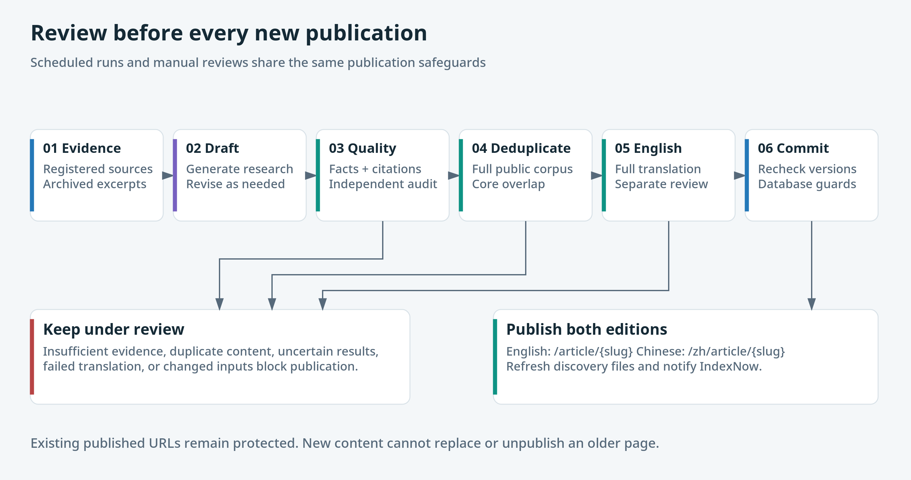
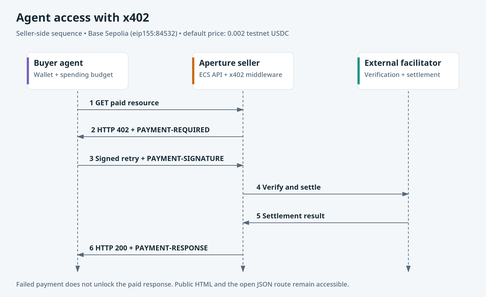

# Architecture

Aperture combines evidence-based publishing with public search discovery and protocol-based agent access. The public website and the operations console are separate applications sharing one Python API and an Aurora PostgreSQL database.

[Open the editable diagrams](architecture/aperture-aws.drawio).

## Request and storage boundaries

Each frontend has a private S3 bucket behind its own CloudFront distribution and Origin Access Control. Public HTML routes, `/api/*`, and `/agent/*` reach an Application Load Balancer and the ECS Fargate API. The API uses Aurora's Data API; browser clients do not access the database or source credentials.

The Python API provides server-rendered HTML, JSON responses, administrator sessions, catalogue operations, research records, schedule management, traffic statistics, and the x402 seller endpoint. The frontends use plain JavaScript, HTML, and CSS. Local development replaces Aurora with PostgreSQL and CloudFront with the development reverse proxy in `server.py`.

Aurora stores articles and their sources, reviewed English editions, permanent redirect mappings, source registrations and agent assignments, research runs and evidence, crawler jobs/artifacts, administrator sessions, settings, traffic aggregates, and business events. The implementation does not require a separate vector database or entity graph.

## Research production

EventBridge Scheduler targets a Lambda bridge rather than invoking AgentCore directly. The bridge requests asynchronous work and returns after acceptance. AgentCore Runtime continues the research task independently.

The runtime loads source registrations and assignments for each invocation. A TypeScript Codex SDK worker generates or repairs bounded crawler code; AgentCore Code Interpreter executes validated artifacts, and Browser handles supported interactive sources. Source credentials are referenced through Secrets Manager. Bedrock supplies model inference for analysis and review.

Publication requires evidence/quality checks, semantic comparison with the full published catalogue, complete English translation, and independent translation review. Model work precedes the final transaction. Before committing, the publisher rechecks the candidate and catalogue so concurrent edits cannot reuse an obsolete review.

Database protections preserve published slugs and status, protect redirect targets, and require an approved English edition matching the source revision when bilingual policy is enabled. A rejected, uncertain, unavailable, or stale review leaves the candidate unpublished. Existing articles are not withdrawn to make room for a newer duplicate.

## Delivery and discovery

English uses the original public paths; Chinese uses `/zh/`. Each edition has its own canonical URL and reciprocal `en`, `zh-CN`, and `x-default` links. Both editions appear in the sitemap. Complete HTML, JSON-LD, RSS, and `llms.txt` support readers, crawlers, and agents without requiring JavaScript rendering.

Client navigation loads the same HTML as direct navigation, including the complete category catalogue. Collection APIs support pagination. Large database results are reconstructed from bounded chunks inside consistent read transactions to avoid Aurora Data API response limits.

After publication, the indexing notifier invalidates affected CloudFront paths and submits both language URLs through IndexNow. An accepted notification establishes delivery of the update request, not search-engine indexing or ranking.

## Machine access and payment

The public article and variant A JSON are open. Variant B requires x402 payment. The seller API creates a payment challenge, verifies the buyer's signed response through an external facilitator, settles it, and returns the content only after settlement succeeds.

The deployed demonstration uses Base Sepolia USDC with a default price of 0.002 USDC. The paid representation is an experiment in protocol-based delivery; the research also remains publicly available. Mainnet revenue and exclusive paid-data value are not established by this demonstration.

The optional source-buying agent uses AgentCore Payments under a configured budget. That buyer capability is distinct from the seller endpoint and external facilitator.

## Measurement and operations

CloudFront Standard Logging v2 sends edge logs to private S3. SQS buffers processing by the traffic aggregation Lambda, which writes hourly counts and HyperLogLog estimates to Aurora. This captures cache hits as well as origin requests. Browser events add session-level source attribution; the API records payment and other business events.

Human/agent classification and visitor counts are estimates. A crawler visit does not prove an AI citation, a 402 challenge is not payment, and a testnet settlement is not commercial revenue.

The admin console exposes content, research, sources, crawlers, jobs, analytics, and settings. Published article titles follow the selected reviewed edition; drafts and original evidence retain source text. Some settings switches currently persist preferences without changing runtime behavior. Alert delivery and automatic analytics cleanup are not implemented; the interface states these limits.

See [deployment](deployment.md), [runtime internals](../agent_runtime/ARCHITECTURE.md), and [functional verification](functional-verification.md) for operational details.
