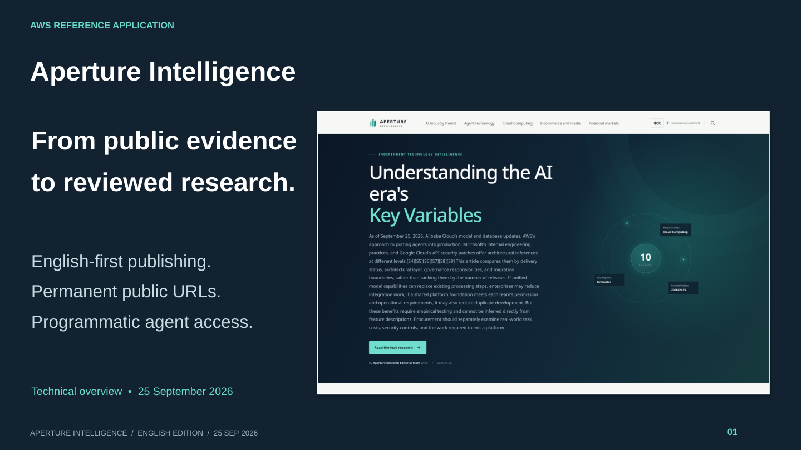

# English presentation

[PowerPoint — 18 slides](aperture-intelligence-en.pptx) · [PDF](aperture-intelligence-en.pdf) · [Editable diagrams](../architecture/aperture-aws.drawio)

[](aperture-intelligence-en.pptx)

This technical overview explains the project purpose, public and admin experiences, AWS architecture, research and publication gates, permanent URLs, x402, measurement, implementation, local installation and deployment. The verification snapshot is **September 25, 2026**.

Slide text is editable in PowerPoint. Diagrams use native draw.io AWS4 service icons and the AWS Cloud boundaries, service colors and layout of the original Chinese diagrams, with updated English labels. The editable draw.io file is the source for all SVG/PNG exports and the corresponding slides. All eleven screenshots come from actual English production interfaces; none uses substituted text or synthetic data. Screenshot URLs, capture times and hashes are recorded in speaker notes and the [capture manifest](../screenshots/manifest.json). The [slide manifest](manifest.json) maps screenshots to slides.

The payment example uses Base Sepolia testnet USDC. Search submissions, traffic estimates and preference-only settings are described with their practical limits. Earlier presentation or project prose was reference material; the deck is based on the current implementation and dated verification evidence.

## Rebuild

Run from the repository root with Python 3.10+. The application environment is needed only to recapture authenticated screens.

```bash
.venv/bin/pip install -r docs/presentation/requirements.txt
.venv/bin/python -m playwright install chromium
.venv/bin/python scripts/build_architecture.py
.venv/bin/python scripts/build_presentation.py
```

CairoSVG needs the system Cairo library. Install Arial, Liberation Sans or Noto Sans for consistent text layout. The diagram renderer uses the pinned local mxGraph/AWS4 assets through Chromium, with network requests disabled. Edit the draw.io file before exporting; the script preserves the editable source. See [diagram maintenance and attribution](../architecture/README.md).

Render the **actual PPTX** with LibreOffice, rather than generating an independent PDF:

```bash
docker build -f docs/presentation/renderer.Dockerfile \
  -t aperture-presentation-renderer:local .
docker run --rm -v "$PWD:/work" aperture-presentation-renderer:local \
  --headless -env:UserInstallation=file:///tmp/aperture-lo-profile \
  --convert-to pdf --outdir /work/docs/presentation \
  /work/docs/presentation/aperture-intelligence-en.pptx
.venv/bin/python scripts/verify_english_materials.py
```

The verification script checks local documentation links, English project prose, native AWS icons, diagram export hashes, embedded diagrams/screenshots, slide bounds and rendered native text. The diagram renderer also checks text overflow using mxGraph's measured label bounds. Verification regenerates the first-slide preview. Inspect the rendered PDF visually after content or layout changes; automated checks do not prove the absence of every visual overlap.

To refresh screenshots, follow the [capture instructions](../screenshots/README.md), then rebuild the diagrams, deck and PDF. Update snapshot dates and claims when refreshing evidence; do not present an old report's metrics as new measurements.
